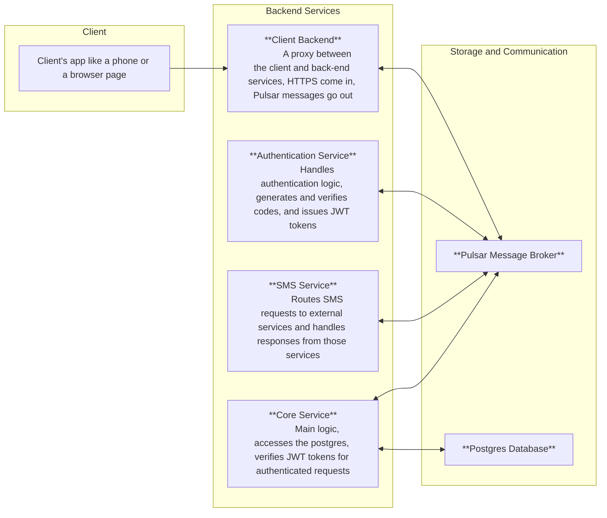
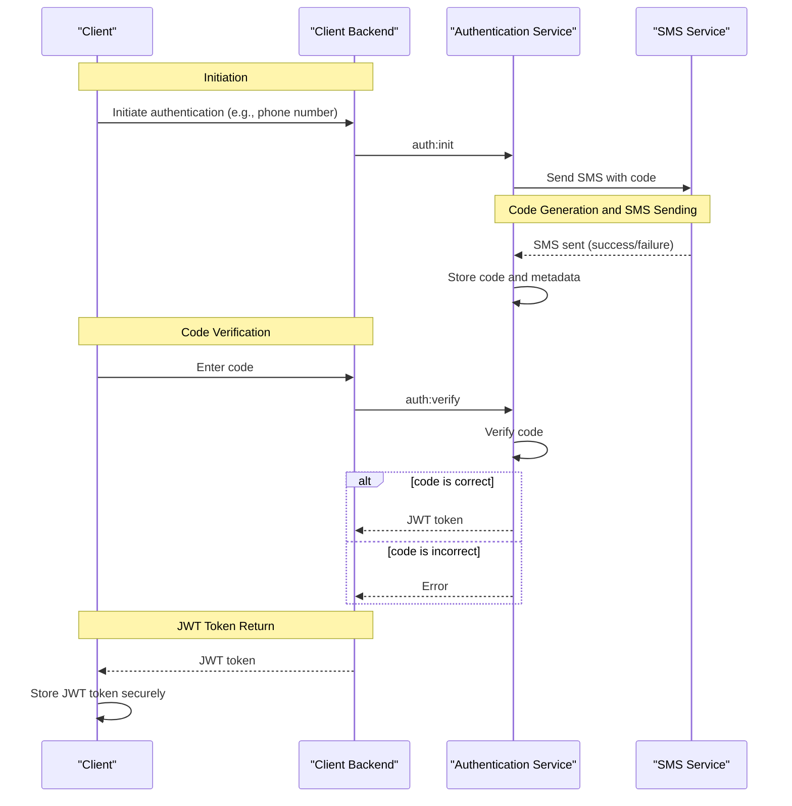
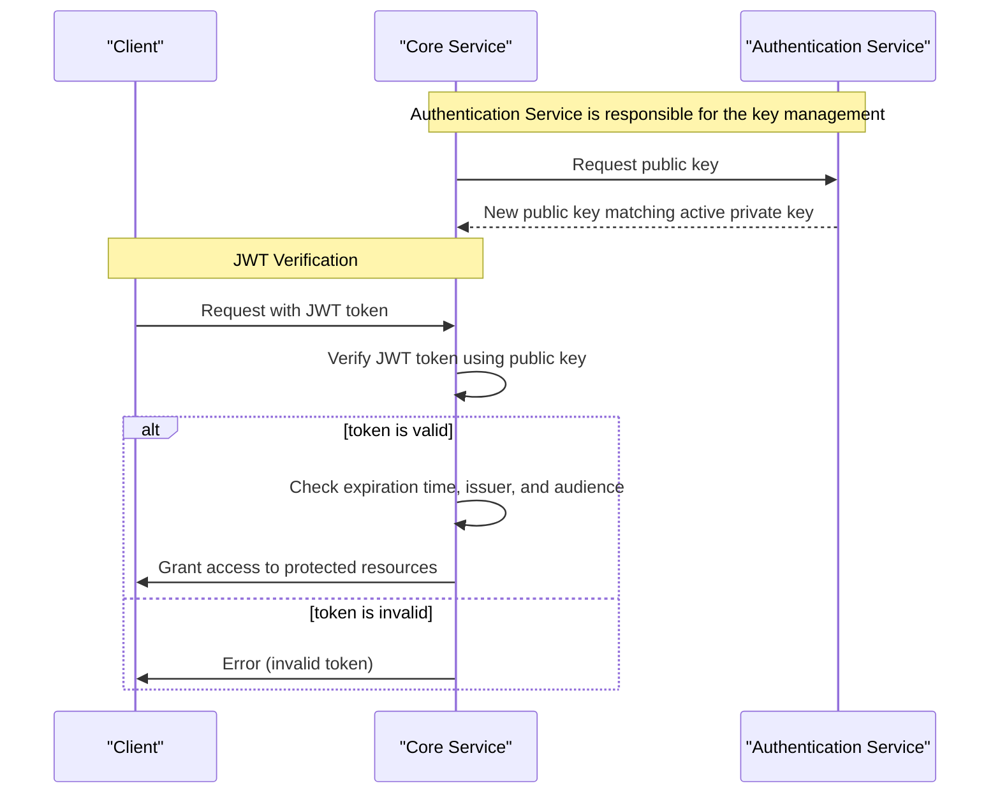

# User Authentication

> This design is subject to change. We do not intend to keep it identical to the actual code, but the overall direction will remain the same.

## Services and Their Responsibilities
Our microservice architecture is designed to provide a scalable and secure system. Each service plays a critical role in ensuring the smooth operation of our application.
### Client
The client initiates the authentication process and receives a JSON Web Token (JWT). It is responsible for securely storing and managing the JWT, which is used to authenticate subsequent requests.
### Client Backend
The client backend acts as a proxy, relaying requests and responses between the client and our backend services. It validates and sanitizes user input to prevent security vulnerabilities and ensures that data is properly formatted.
### Authentication Service
This service handles all authentication-related logic, including generating and verifying codes, and issuing JWTs. It is responsible for managing user authentication data and session state, ensuring that only authorized users can access our system.
### Core Service
The core service provides the main business logic of our application and has access to our PostgreSQL database. It verifies JWTs for authenticated requests and enforces access control and authorization policies to ensure that users can only access authorized resources.
### SMS Service
The SMS service acts as a proxy between our internal system and external SMS services, sending messages to users on behalf of our application. It routes SMS requests to the appropriate external service and handles responses, ensuring that users receive timely and relevant updates.
### Pulsar Message Broker
The Pulsar Message Broker is a messaging system that enables our services to communicate with each other in a publish-subscribe manner. It provides a scalable and fault-tolerant way for our services to exchange data and ensures that our system remains highly available.

## Authentication Flow

The following sequence diagram illustrates the authentication process, highlighting the interactions between the Client, Client Backend, Authentication Service, and SMS Service.

As shown in the diagram, the authentication process begins with the Client initiating the authentication process by sending a request to the Client Backend. The Client Backend then sends a request to the Authentication Service to initiate authentication.

The Authentication Service generates a random code and sends a request to the SMS Service to send an SMS with the code to the client's phone number. The SMS Service sends the SMS and notifies the Authentication Service of the result.

Once the client receives the SMS, they enter the code on their device, and the Client Backend sends a request to the Authentication Service to verify the code. The Authentication Service verifies the code and generates a JWT token if the code is correct.

Finally, the Authentication Service returns the JWT token to the Client Backend, which then returns it to the Client. The Client stores the JWT token securely and uses it to authenticate subsequent requests.
Note that the diagram highlights the alternative path taken when the code is incorrect. In this case, the Authentication Service returns an error to the Client Backend, which is then propagated to the Client.

## JWT Verification by the Core Service
The verification process is critical for ensuring that only authenticated users can access protected resources. To verify JWT tokens, the Core Service needs to know the secret key used to sign the tokens. We use Public Key Infrastructure (PKI), where the Authentication Service uses a private key to sign JWT tokens, and the Core Service uses the corresponding public key to verify the tokens.

Verification Process:
* When the Client sends a request to the Core Service with a JWT token, the Core Service verifies the token using the public key and grants access to protected resources if the token is valid.
* The Core Service checks the token's expiration time, issuer, and audience to ensure that it is valid and not tampered with.

## Key Rotation
Key rotation is an essential process in maintaining the security of the Public Key Infrastructure (PKI) used in our system. It is designed to minimize disruptions to the system while ensuring the security of JWT tokens.

Rotation process:
* Generate a new private key and corresponding public key.
* Update the Authentication Service to use the new private key.
* Distribute the new public key to the Core Service, which uses it to verify tokens.
* During the transition period, both the old and new keys are accepted to minimize disruptions to the system.
* Once the new keys are fully deployed, the old keys are revoked, and the system is updated to use the new keys exclusively.
