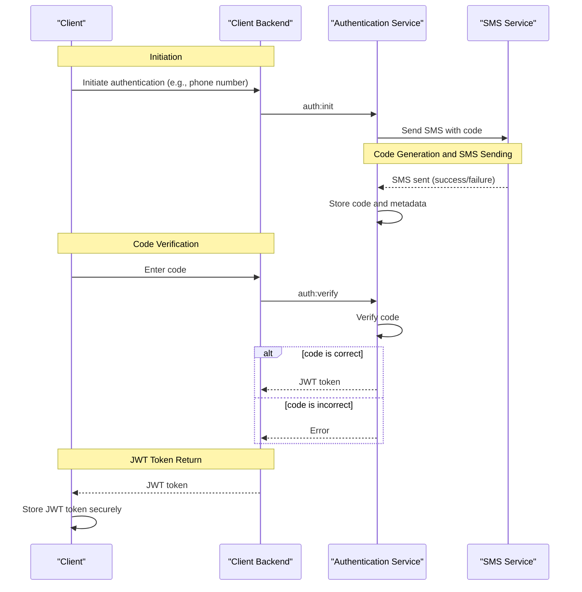
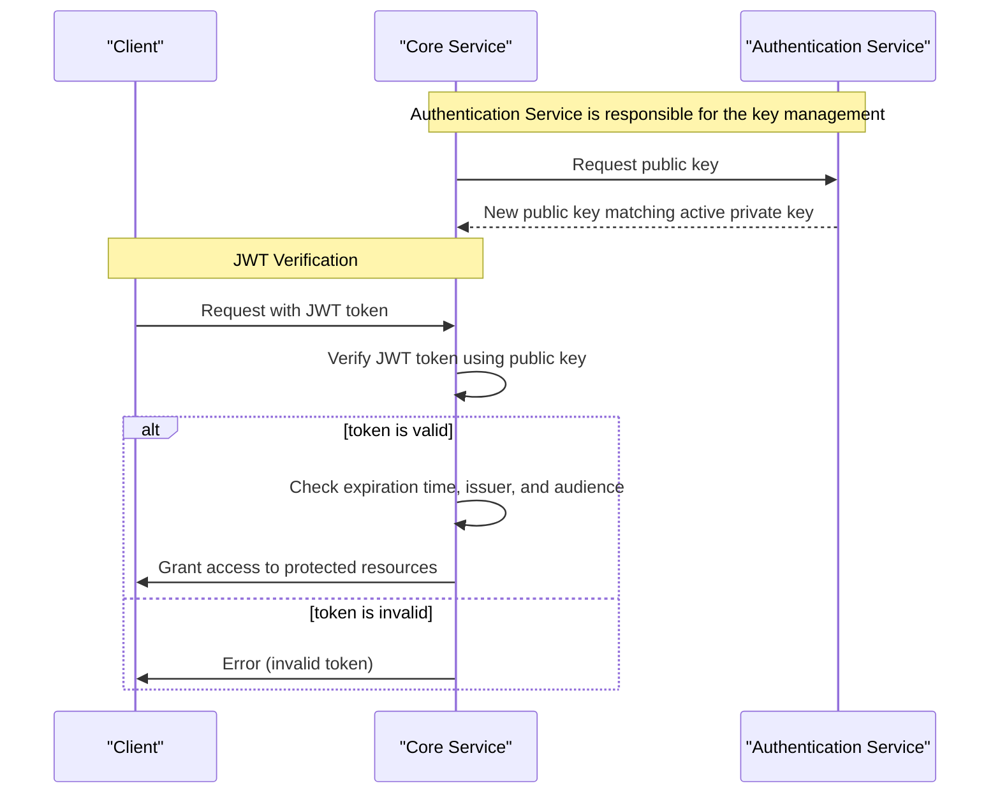

# User Authentication

## Overview
This documentation is intended for developers and system administrators who need to understand the authentication process and its components.

## Services and their Responsibilities
This section describes the roles and responsibilities of each service in the system.

1. Client

Initiates the authentication process and receives the JWT token. Responsible for storing and managing the JWT token securely. The Client is typically a web or mobile application that interacts with the system.

2. Client Backend

Acts as a proxy, relaying requests and responses between the Client (front-end) and both the Authentication and the Core Service (back-end). Responsible for validating and sanitizing user input.

3. Authentication Service

Handles authentication logic, generates and verifies codes, and issues JWT tokens. Responsible for managing user authentication data and session state.

4. Core Service

Provides the main logic and has access to the database. Verifies JWT tokens for authenticated requests.
Responsible for enforcing access control and authorization policies.

5. SMS Service

Acts as a proxy between our internal system and external SMS services, sending SMS messages to users on behalf of the system. Responsible for routing SMS requests to the appropriate external service and handling responses.

6. Pulsar Message Broker

The Pulsar Message Broker is a messaging system that enables communication between services in a pub-sub manner.

## Authentication Flow

This section describes the sequence of events that occur during the authentication process.
1. Initiation
* The Client sends a request to the Client Backend to initiate the authentication process (e.g., providing their phone number).
* The Client Backend sends a request to the Authentication Service to initiate authentication (e.g., auth:init).
* The Authentication Service generates a random code and sends a request to the SMS Service to send an SMS with the code to the client's phone number.

2. Code Generation and SMS Sending
* The SMS Service sends the SMS and notifies the Authentication Service of the result (e.g., success or failure).
* The Authentication Service stores the code and its associated metadata (e.g., expiration time).

3. Code Verification
* The client receives the SMS and enters the code on their device.
* The Client sends the code to the Client Backend, which then sends a request to the Authentication Service to verify the code (e.g., auth:verify).
* The Authentication Service verifies the code and generates a JWT token if the code is correct.

4. JWT Token Return
* The Authentication Service returns the JWT token to the Client Backend, which then returns it to the Client.
* The Client stores the JWT token securely and uses it to authenticate subsequent requests.

## JWT Verification by the Core Service
The verification process is critical for ensuring that only authenticated users can access protected resources. To verify JWT tokens, the Core Service needs to know the secret key used to sign the tokens. We use Public Key Infrastructure (PKI), where the Authentication Service uses a private key to sign JWT tokens, and the Core Service uses the corresponding public key to verify the tokens.

Verification Process:
* When the Client sends a request to the Core Service with a JWT token, the Core Service verifies the token using the public key and grants access to protected resources if the token is valid.
* The Core Service checks the token's expiration time, issuer, and audience to ensure that it is valid and not tampered with.

## Key Rotation
Key rotation is an essential process in maintaining the security of the Public Key Infrastructure (PKI) used in our system. It is designed to minimize disruptions to the system while ensuring the security of JWT tokens.

Rotation process:
* Generate a new private key and corresponding public key.
* Update the Authentication Service to use the new private key.
* Distribute the new public key to the Core Service, which uses it to verify tokens.
* During the transition period, both the old and new keys are accepted to minimize disruptions to the system.
* Once the new keys are fully deployed, the old keys are revoked, and the system is updated to use the new keys exclusively.
