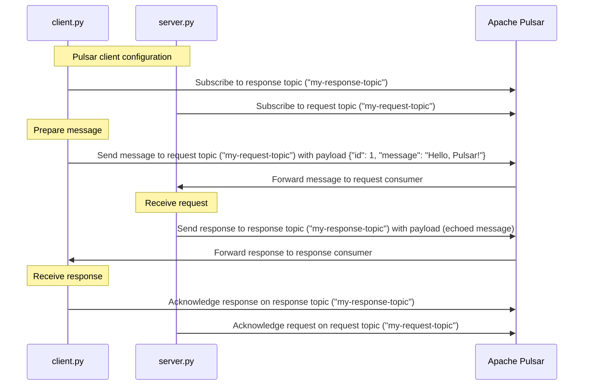

# Basic Client-Server Demo

This sequence diagram illustrates the interaction between a client (client.py) and a server (server.py) using Apache Pulsar as a messaging system. The sequence shows how the client sends a request to the server, and the server responds back to the client through Pulsar topics.

